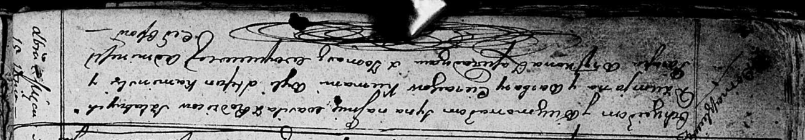

**Церах Василь Демьянов (Cierach Wasil)**

15 декабря 1812 г -- крещение (НИАБ 136-13-894, лист 85об, №60/1812-р
(ориг)).

**НИАБ 136-13-894:** Лист 85об. **Метрическая запись №60/1812-р
(ориг).**

{width="6.496527777777778in"
height="1.1371773840769903in"}

Осовская Покровская церковь. 15 декабря 1812 года. Метрическая запись о
крещении.

Cierach Wasil -- сын родителей с деревни Домашковичи.

Cierach Dziemjan -- отец.

Cierachowa Barbara -- мать.

Kaminski Stefan -- кум.

Brytkowa Parasia -- кума.

Woyniewicz Tomasz -- ксёндз родителей с деревни.
