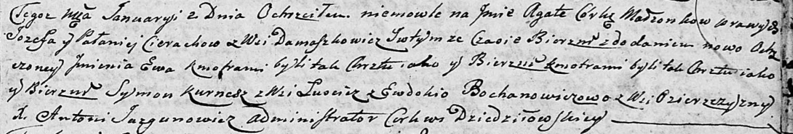

**Церах Агата Иосифова (Cierachowna Agata Ewa)**

2 января 1805 г -- крещение (НИАБ 136-13-894, лист 56, №3/1805-р
(ориг)).

**НИАБ 136-13-894:** Лист 56. **Метрическая запись №3/1805-р (ориг).**

Дедиловичская Покровская церковь. 2 января 1805 года. Метрическая запись
о крещении.

Cierachowna Agata Ewa -- дочь родителей с деревни Домашковичи.

Cierach Jozef -- отец.

Cierachowa Pałanieja -- мать.

Kurnesz Symon -- кум, с деревни Лустичи.

Bochanowiczowa Ewdokija -- кума, с деревни Озерщизна.

Jazgunowicz Antoni -- ксёндз.
