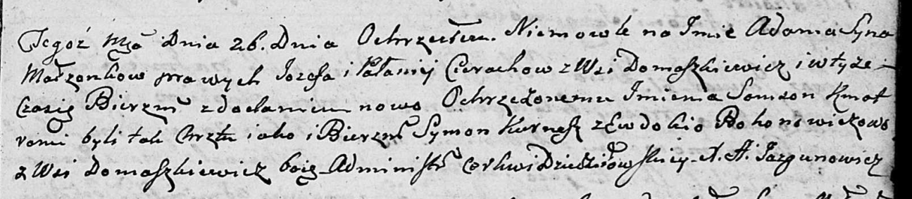

**Церах Адам Иосифов (Cierach Adam Samson)**

26 декабря 1802 г -- крещение (НИАБ 136-13-894, лист 49, №47/1802-р
(ориг)).

**НИАБ 136-13-894:** Лист 49. **Метрическая запись №47/1802-р (ориг).**

Дедиловичская Покровская церковь. 26 декабря 1802 года. Метрическая
запись о крещении.

Cierach Adam Samson -- сын родителей с деревни Домашковичи.

Cierach Jozef -- отец.

Cierachowa Pałanieja -- мать.

Kurnesz Symon -- кум, с деревни Домашковичи.

Bohonewiczowa Ewdokija -- кума, с деревни Домашковичи.

Jazgunowicz Antoni -- ксёндз.
