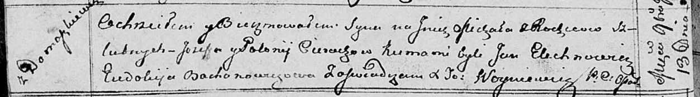

**Церах Михал Иосифов (Cierach Michał)**

13 ноября 1813 г -- крещение (НИАБ 136-13-894, лист 87об, №39/1813-р
(ориг)).

**НИАБ 136-13-894:** Лист 87об. **Метрическая запись №39/1813-р
(ориг).**

Осовская Покровская церковь. 13 ноября 1813 года. Метрическая запись о
крещении.

Cierach Michał -- сын родителей с деревни Домашковичи.

Cierach Jozef -- отец.

Cierachowa Połonija -- мать.

Elechnowicz Jan -- кум.

Bachonowiczowa Eudokija -- кума.

Woyniewicz Tomasz -- ксёндз.
