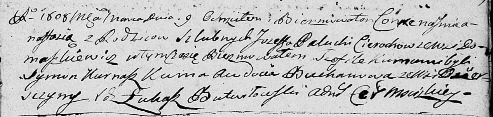

**Церах Настасья Иосифова (Cierachowna Nastazya Teofila)**

9 марта 1808 г -- крещение дочери Настасьи Теофили (НИАБ 136-13-894,
лист 65, №14/1808-р (ориг)).

**НИАБ 136-13-894:** Лист 65. **Метрическая запись №14/1808-р (ориг).**

Дедиловичская Покровская церковь. 9 марта 1808 года. Метрическая запись
о крещении.

Cierachowna Nastazya Teofiła -- дочь родителей с деревни Домашковичи.

Cierach Jozef -- отец.

Cierachowa Palucha -- мать.

Kurnasz Symon -- кум.

Buchanowa \[Bachanowiczowa\] Awdocia -- кума, с деревни Озерщизна.

Butwilowski Lukasz -- ксёндз, администратор Мстижской церкви.
