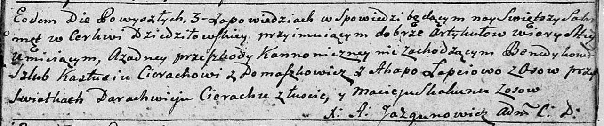

**Церах Константы (Cierach Konstanty, Kastuś)**

7 октября 1792 г -- венчание с Агапой Лапец с деревни Осово (НИАБ
136-13-894, лист 71, №16/1792-б (ориг)).

17 июля 1804 г -- крещение сына Степана (НИАБ 136-13-894, лист 54,
№22/1804-р (ориг)).

**НИАБ 136-13-894:** Лист 71. **Метрическая запись №16/1792-б (ориг).**

Дедиловичская Покровская церковь. 7 октября 1792 года. Метрическая
запись о венчании.

Cierach Kastuś -- жених, с деревни Домашковичи.

Łapciowa Ahapa -- невеста, с деревни Осово.

Cierach Darachwiey -- свидетель, с деревни Лустичи.

Skakun Maciey -- свидетель, с деревни Осово.

Jazgunowicz Antoni -- ксёндз.

**НИАБ 136-13-894:** Лист 54. **Метрическая запись №22/1804-р (ориг).**

Дедиловичская Покровская церковь. 17 июля 1804 года. Метрическая запись
о крещении.

Cierach Stefan -- сын родителей с деревни Домашковичи.

Cierach Konstanty -- отец.

Cierachowa Ahafija -- мать.

Kułakowski Karniey -- кум.

Sieczkowa Wiara -- кума.

Jazgunowicz Antoni -- ксёндз.
