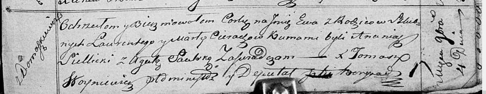

**Церах Ева Лавренова (Cierachowna Ewa)**

4 ноября 1818 г -- крещение дочери Евы (НИАБ 136-13-894, лист 99,
№36/1818-р (ориг)).

**НИАБ 136-13-894:** Лист 99. **Метрическая запись №36/1818-р (ориг).**

{width="6.496527777777778in"
height="1.2726192038495188in"}

Осовская Покровская церковь. 4 ноября 1818 года. Метрическая запись о
крещении.

Cierachowna Ewa -- дочь родителей с деревни Домашковичи.

Cierach Łaurenty -- отец.

Cierachowa Marta -- мать.

Siellicki Ananiasz -- кум.

Saulska Agata -- кума.

Woyniewicz Tomasz -- ксёндз.
