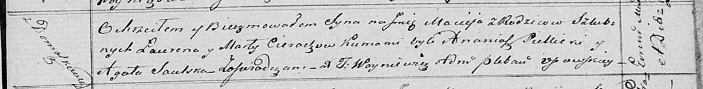

**Церах Лаврен, Лавренты (Cierach Łauren, Łaurenty)**

30 сентября 1816 г -- крещение сына Адама (НИАБ 136-13-894, лист 94об,
№34/1816-р (ориг)).

4 ноября 1818 г -- крещение дочери Евы (НИАБ 136-13-894, лист 99,
№36/1818-р (ориг)).

27 ноября 1820 г -- крещение сына Мацея (НИАБ 136-13-894, лист 105,
№40/1820-р (ориг)).

**НИАБ 136-13-894:** Лист 94об. **Метрическая запись №34/1816-р
(ориг).**

Осовская Покровская церковь. 30 сентября 1816 года. Метрическая запись о
крещении.

Cierach Adam -- сын родителей с деревни Домашковичи.

Cierach Łauren -- отец.

Cierachowa Marta -- мать.

Sielicki Ananiasz -- кум.

Saulska Agata -- кума.

Woyniewicz Tomasz -- ксёндз.

**НИАБ 136-13-894:** Лист 99. **Метрическая запись №36/1818-р (ориг).**

Осовская Покровская церковь. 4 ноября 1818 года. Метрическая запись о
крещении.

Cierachowna Ewa -- дочь родителей с деревни Домашковичи.

Cierach Łaurenty -- отец.

Cierachowa Marta -- мать.

Siellicki Ananiasz -- кум.

Saulska Agata -- кума.

Woyniewicz Tomasz -- ксёндз.

**НИАБ 136-13-894:** Лист 105. **Метрическая запись №40/1820-р (ориг).**

Осовская Покровская церковь. 27 ноября 1820 года. Метрическая запись о
крещении.

Cierach Maciey -- сын родителей с деревни Домашковичи.

Cierach Łauren -- отец.

Cierachowa Marta -- мать.

Siellicki Ananiasz -- кум.

Saulska Agata -- кума.

Woyniewicz Tomasz -- ксёндз.
