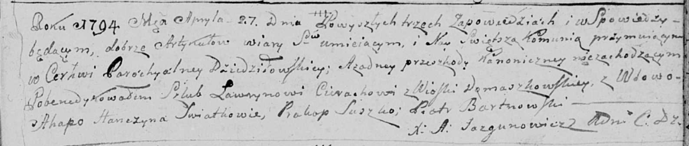

**Церах (в 1м браке -- Ганчына) Агапа (Cierachowa (Hanczyna) Ahapa)**

27 апреля 1794 г -- венчание с вдовой Агапой Ганчыной (НИАБ 136-13-920,
лист 1, №3/1794-б (ориг)).

**РГИА 823-2-18:** Лист 1. **Метрическая запись №3/1794-б (ориг).**

Дедиловичская Покровская церковь. 27 апреля 1794 года. Метрическая
запись о венчании.

Cierach Ławryn -- жених, деревня Домашковичи.

Hanczyna Ahapa -- невеста, вдова.

Suszko Prakop -- свидетель.

Bartnowski Piotr -- свидетель.

Jazgunowicz Antoni -- ксёндз.
