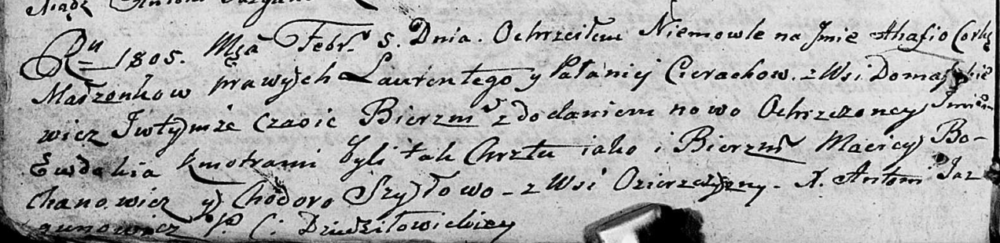

**Церах Агафия Лаврынова (Cierachowna Ahafia Ewdokia)**

5 февраля 1805 г -- крещение (НИАБ 136-13-894, лист 56об, №15/1805-р
(ориг)).

**НИАБ 136-13-894:** Лист 56об. **Метрическая запись №15/1805-р
(ориг).**

Дедиловичская Покровская церковь. 5 февраля 1805 года. Метрическая
запись о крещении.

Cierachowna Ahafia Ewdokia -- дочь родителей с деревни Домашковичи.

Cierach Łaurenty -- отец.

Cierachowa Pałanieja -- мать.

Bochanowicz Maciey -- кум.

Szyłowa Chodora -- кума, с деревни Озерщизна.

Jazgunowicz Antoni -- ксёндз.
