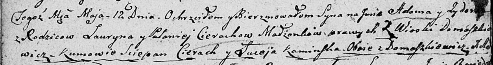

**Церах Адам Лаврынов (Cierach Adam Sydor)**

12 мая 1807 г -- крещение (НИАБ 136-13-894, лист 62об, №24/1807-р
(ориг)).

**НИАБ 136-13-894:** Лист 62об. **Метрическая запись №24/1807-р
(ориг).**

Дедиловичская Покровская церковь. 12 мая 1807 года. Метрическая запись о
крещении.

Cierach Adam Sydor -- сын родителей с деревни Домашковичи.

Cierach Łauryn -- отец.

Cierachowa Pałanieja -- мать.

Cierach Sciepan -- кум, с деревни Домашковичи.

Kaminska Luceja -- кума, с деревни Домашковичи.

Jazgunowicz Antoni -- ксёндз.
