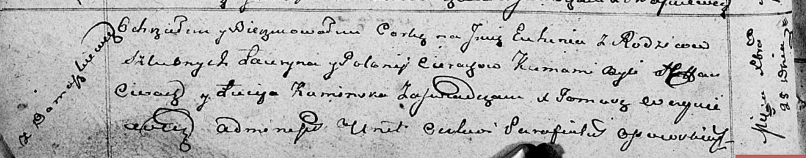

**Церах Евгения Лаврынова (Cierachowna Euhenija)**

25 декабря 1811 г -- крещение дочери Евгении (НИАБ 136-13-894, лист
82об, №67/1811-р (ориг)).

**НИАБ 136-13-894:** Лист 82об. **Метрическая запись №67/1811-р
(ориг).**

{width="6.496527777777778in"
height="1.2753018372703413in"}

Осовская Покровская церковь. 25 декабря 1811 года. Метрическая запись о
крещении.

Cierachowna Euhenija -- дочь родителей с деревни Домашковичи.

Cierach Łauryn -- отец.

Cierachowa Połonija -- мать.

Cierach Stefan -- кум.

Kaminska Lucija -- кума.

Woyniewicz Tomasz -- ксёндз.
