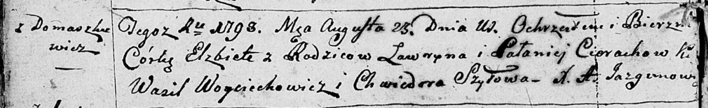
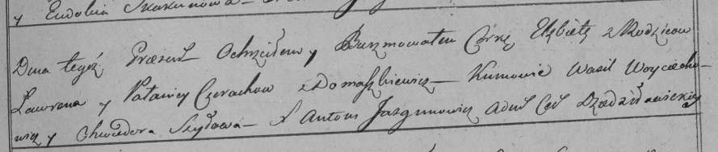

**Церах Елисавета Лаврынова (Cierachowna Elżbieta)**

23 августа 1798 г -- крещение (НИАБ 136-13-894, лист 36об, №38/1798-р
(ориг)), (РГИА 823-2-18, лист 265, №38/1798-р (коп)).

Лист 36об. **Метрическая запись №38/1798-р (ориг).**

Дедиловичская Покровская церковь. 23 августа 1798 года. Метрическая
запись о крещении.

Cierachowna Elżbieta -- дочь родителей с деревни Домашковичи.

Cierach Ławryn -- отец.

Cierachowa Pałanieja -- мать.

Woyciechowicz Wasil - кум.

Szyłowa Chwiedora - кума.

Jazgunowicz Antoni -- ксёндз.

**РГИА 823-2-18:** Лист 265. **Метрическая запись №38/1798-р (коп).**

Дедиловичская Покровская церковь. 23 августа 1798 года. Метрическая
запись о крещении.

Cierachowna Elżbieta -- дочь родителей с деревни Домашковичи.

Cierach Ławren -- отец.

Cierachowa Pałanieja -- мать.

Woyciechowicz Wasil -- кум.

Szyłowa Chwiedora -- кума.

Jazgunowicz Antoni -- ксёндз.
