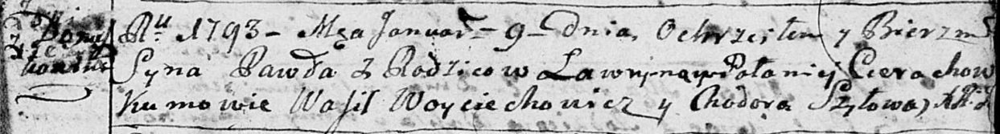

**Церах Павел Лаврынов (Cierach Ławryn)**

9 января 1793 г -- крещение НИАБ 136-13-894, лист 18, №5/1793-р (ориг).

**НИАБ 136-13-894:** Лист 18. **Метрическая запись №5/1793-р (ориг).**

Дедиловичская Покровская церковь. 9 января 1793 года. Метрическая запись
о крещении.

Cierach Paweł -- сын родителей с деревни Домашковичи.

Cierach Ławryn -- отец.

Cierachowa Połonieja -- мать.

Woyciechowicz Wasil -- кум.

Szyłowa Chodora -- кума.

Jazgunowicz Antoni -- ксёндз.
