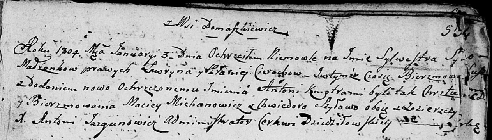

**Церах Сильвестер Лаврынов (Cierach Silwester Antoni)**

3 января 1804 г -- крещение (НИАБ 136-13-894, лист 53, №2/1804-р
(ориг)).

Лист 53. **Метрическая запись №2/1804-р (ориг).**

Дедиловичская Покровская церковь. 3 января 1804 года. Метрическая запись
о крещении.

Cierach Silwester Antoni -- сын родителей с деревни Домашковичи.

Cierach Ławryn -- отец.

Cierachowa Pałanieja -- мать.

Michanowicz Maciey -- кум, с деревни Заречье.

Szyłowa Chwiedora -- кума, с деревни Заречье.

Jazgunowicz Antoni -- ксёндз.
