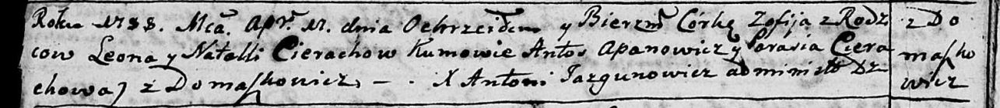
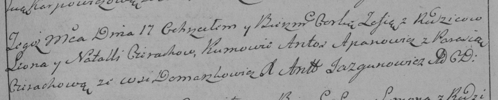

**Церах Зофия Леонова (Cierachowna Zofija)**

17 апреля 1788 г -- крещение (НИАБ 136-13-894, лист 4об, №28/1788-р
(ориг)), (РГИА 823-2-18, лист 236, №12/1788-р (коп)).

**НИАБ 136-13-894:** Лист 4-об. **Метрическая запись №28/1788-р
(ориг).**

Дедиловичская Покровская церковь. 17 апреля 1788 года. Метрическая
запись о крещении.

Cierachowna Zofija -- дочь родителей с деревни Домашковичи.

Cierach Leon-- отец.

Cierachowa Natalla -- мать.

Apanowicz Antoś - кум.

Cierachowa Parasia - кума.

Jazgunowicz Antoniusz -- ксёндз.

**РГИА 823-2-18:** Лист 236. **Метрическая запись №12/1788-р (коп).**

Дедиловичская Покровская церковь. 17 апреля 1788 года. Метрическая
запись о крещении.

Cierachowna Zofia -- дочь родителей с деревни Домашковичи.

Cierach Leon -- отец.

Cierachowa Natalla -- мать.

Apanowicz Antos -- кум.

Cierachowa Parasia - кума.

Jazgunowicz Antoni -- ксёндз.
