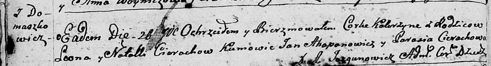

**Церах Катерина Леонова (Cierachowna Katerzyna)**

26 ноября 1794 г -- крещение НИАБ 136-13-894, лист 23об, №58/1794-р
(ориг)).

**НИАБ 136-13-894:** Лист 23об. **Метрическая запись №58/1794-р
(ориг).**

{width="6.496527777777778in"
height="0.8890901137357831in"}

Дедиловичская Покровская церковь. 26 ноября 1794 года. Метрическая
запись о крещении.

Cierachowna Katerzyna -- родителей с деревни Домашковичи.

Cierach Leon -- отец.

Cierachowa Natalla -- мать.

Ahapanowicz Jan - кум.

Cierachowa Parasia - кума.

Jazgunowicz Antoni -- ксёндз.
