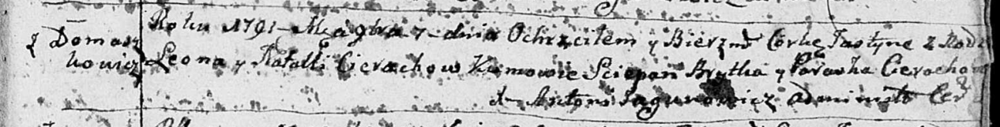

**Церах Наталья (Cierachowa Natalla)**

17 апреля 1788 г -- крещение дочери Зофии НИАБ 136-13-894, лист 4об,
№28/1788-р (ориг)), (РГИА 823-2-18, лист 236, №12/1788-р (коп)).

7 ноября 1791 г -- крещение дочери Юстыны НИАБ 136-13-894, лист 14,
№52/1791-р (ориг)), (РГИА 823-2-18, лист 243, №29/1791-р (коп)).

26 ноября 1794 г -- крещение дочери Катерины НИАБ 136-13-894, лист 23об,
№58/1794-р (ориг)).

**НИАБ 136-13-894:** Лист 4-об. **Метрическая запись №28/1788-р
(ориг).**

{width="6.496527777777778in"
height="0.7080533683289589in"}

Дедиловичская Покровская церковь. 17 апреля 1788 года. Метрическая
запись о крещении.

Cierachowna Zofija -- дочь родителей с деревни Домашковичи.

Cierach Leon-- отец.

Cierachowa Natalla -- мать.

Apanowicz Antoś - кум.

Cierachowa Parasia - кума.

Jazgunowicz Antoniusz -- ксёндз.

**РГИА 823-2-18:** Лист 236. **Метрическая запись №12/1788-р (коп).**

{width="6.496527777777778in"
height="1.3041666666666667in"}

Дедиловичская Покровская церковь. 17 апреля 1788 года. Метрическая
запись о крещении.

Cierachowna Zofia -- дочь родителей с деревни Домашковичи.

Cierach Leon -- отец.

Cierachowa Natalla -- мать.

Apanowicz Antos -- кум.

Cierachowa Parasia - кума.

Jazgunowicz Antoni -- ксёндз.

**НИАБ 136-13-894:** Лист 14. **Метрическая запись №52/1791-р (ориг).**

{width="6.496527777777778in"
height="0.8260629921259842in"}

Дедиловичская Покровская церковь. 7 ноября 1791 года. Метрическая запись
о крещении.

Cierachowna Justyna -- дочь родителей с деревни Домашковичи.

Cierach Leon -- отец.

Cierachowa Natalla -- мать.

Brytka Sciepan - кум.

Cierachowa Paraska - кума.

Jazgunowicz Antoni -- ксёндз.

**РГИА 823-2-18:** Лист 243. **Метрическая запись №29/1791-р (коп).**

{width="6.496527777777778in"
height="1.4326388888888888in"}

Дедиловичская Покровская церковь. 7 ноября 1791 года. Метрическая запись
о крещении.

Cierachowna Justynia -- дочь родителей с деревни Домашковичи.

Cierach Leon -- отец.

Cierachowa Natalla -- мать.

Brytka Sciepan -- кум.

Cierachowa Paraska - кума.

Jazgunowicz Antoni -- ксёндз.

**НИАБ 136-13-894:** Лист 23об. **Метрическая запись №58/1794-р
(ориг).**

{width="6.496527777777778in"
height="0.8890901137357831in"}

Дедиловичская Покровская церковь. 26 ноября 1794 года. Метрическая
запись о крещении.

Cierachowna Katerzyna -- родителей с деревни Домашковичи.

Cierach Leon -- отец.

Cierachowa Natalla -- мать.

Ahapanowicz Jan - кум.

Cierachowa Parasia - кума.

Jazgunowicz Antoni -- ксёндз.
