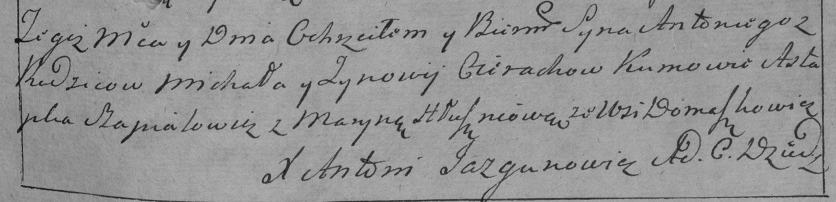

**Церах Антон Михалов (Cierach Antonij)**

3 октября 1792 г -- крещение (НИАБ 136-13-894, лист 17, №60/1792-р
(ориг)), (РГИА 823-2-18, лист 245, №29/1792-р (коп)).

**НИАБ 136-13-894:** Лист 17. **Метрическая запись №60/1792-р (ориг).**

{width="6.496527777777778in"
height="0.8468482064741907in"}

Дедиловичская Покровская церковь. 3 октября 1792 года. Метрическая
запись о крещении.

Cierach Antonij -- сын родителей с деревни Домашковичи.

Cierach Michał -- отец.

Cierachowa Zynowija -- мать.

Szapialewicz Astapka - кум.

Hłuszniowa Maryna - кума.

Jazgunowicz Antoni -- ксёндз.

**РГИА 823-2-18:** Лист 245. **Метрическая запись №29/1792-р (коп).**

{width="6.496527777777778in"
height="1.5694444444444444in"}

Дедиловичская Покровская церковь. 3 октября 1792 года. Метрическая
запись о крещении.

Cierach Antoni -- сын родителей с деревни Домашковичи.

Cierach Michał -- отец.

Cierachowa Zynowija -- мать.

Szapialewicz Astapka -- кум.

Hłuszniowa Maryna -- кума.

Jazgunowicz Antoni -- ксёндз.
