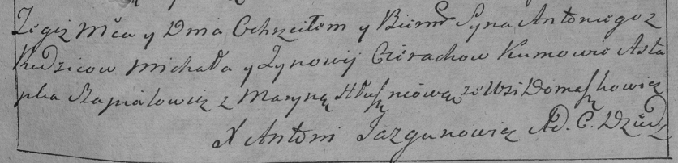

**Церах Зыновья (Cierachowa Zenowija, Zynowia, Zynowija)**

8 октября 1783 г -- крещение дочери Параски (РГИА 823-2-18, лист 225,
№26/1783-р (коп)).

13 января 1786 г -- крещение дочери Юстыны (РГИА 823-2-18, лист 230об,
№2/1786-р (коп)).

26 октября 1790 г -- крещение сына Якуба (НИАБ 136-13-894, лист 11об,
№74/1790-р (ориг)).

3 октября 1792 г -- крещение сына Антона (НИАБ 136-13-894, лист 17,
№60/1792-р (ориг)), (РГИА 823-2-18, лист 245, №29/1792-р (коп)).

23 марта 1796 г -- крещение сына Адама (НИАБ 136-13-894, лист 28об,
№35/1796-р (ориг)), (РГИА 823-2-18, лист 255об, №15/1796-р (коп)).

**РГИА 823-2-18:** Лист 225. **Метрическая запись №26/1783-р (коп).**

Дедиловичская Покровская церковь. 8 октября 1783 года. Метрическая
запись о крещении.

Cierachowna Paraska -- дочь родителей с деревни Домашковичи.

Cierach Michał -- отец.

Cierachowa Zenowia -- мать.

Szpialewicz Astafi -- кум.

Hłuszniowa Połonia - кума.

Jazgunowicz Antoni -- ксёндз.

**РГИА 823-2-18:** Лист 230об. **Метрическая запись №2/1786-р (коп).**

Дедиловичская Покровская церковь. 13 января 1786 года. Метрическая
запись о крещении.

Cierachowna Justyna -- дочь родителей с деревни Домашковичи.

Cierach Michał -- отец.

Cierachowa Zinowija -- мать.

Szapielewicz Astap -- кум.

Hłuszniowa Maryna - кума.

Jazgunowicz Antoni -- ксёндз.

**НИАБ 136-13-894:** Лист 11об. **Метрическая запись №74/1790-р
(ориг).**

Дедиловичская Покровская церковь. 26 октября 1790 года. Метрическая
запись о крещении.

Cierach Jakub -- сын родителей с деревни Домашковичи.

Cierach Michał -- отец.

Cierachowa Zynowia -- мать.

Szapiałowicz Astap - кум.

Hłuszńiowa Maryna - кума.

Jazgunowicz Antoni -- ксёндз.

**НИАБ 136-13-894:** Лист 17. **Метрическая запись №60/1792-р (ориг).**

Дедиловичская Покровская церковь. 3 октября 1792 года. Метрическая
запись о крещении.

Cierach Antonij -- сын родителей с деревни Домашковичи.

Cierach Michał -- отец.

Cierachowa Zynowija -- мать.

Szapialewicz Astapka - кум.

Hłuszniowa Maryna - кума.

Jazgunowicz Antoni -- ксёндз.

**РГИА 823-2-18:** Лист 245. **Метрическая запись №29/1792-р (коп).**

Дедиловичская Покровская церковь. 3 октября 1792 года. Метрическая
запись о крещении.

Cierach Antoni -- сын родителей с деревни Домашковичи.

Cierach Michał -- отец.

Cierachowa Zynowija -- мать.

Szapialewicz Astapka -- кум.

Hłuszniowa Maryna -- кума.

Jazgunowicz Antoni -- ксёндз.

**НИАБ 136-13-894:** Лист 28-об. **Метрическая запись №35/1796-р
(ориг).**

Дедиловичская Покровская церковь. 23 марта 1796 года. Метрическая запись
о крещении.

Cierach Adam -- сын родителей с деревни Домашковичи.

Cierach Michał -- отец.

Cierachowa Zynowija -- мать.

Szapialiewicz Chwiedor - кум.

Hłuszniowa Maryna - кума.

Jazgunowicz Antoni -- ксёндз.

**РГИА 823-2-18:** Лист 255об. **Метрическая запись №15/1796-р (коп).**

Дедиловичская Покровская церковь. 23 марта 1796 года. Метрическая запись
о крещении.

Cierach Adam -- сын родителей с деревни Домашковичи.

Cierach Michał -- отец.

Cierachowa Zynowija -- мать.

Szpialewicz Chwiedor -- кум.

Hłuszniowa Maryna -- кума.

Jazgunowicz Antoni -- ксёндз.
