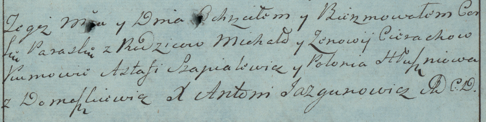

**Церах Параска Михалова (Cierachowna Paraska)**

8 октября 1783 г -- крещение (РГИА 823-2-18, лист 225, №26/1783-р
(коп)).

**РГИА 823-2-18:** Лист 225. **Метрическая запись №26/1783-р (коп).**

{width="6.496527777777778in"
height="1.6402777777777777in"}

Дедиловичская Покровская церковь. 8 октября 1783 года. Метрическая
запись о крещении.

Cierachowna Paraska -- дочь родителей с деревни Домашковичи.

Cierach Michał -- отец.

Cierachowa Zenowia -- мать.

Szpialewicz Astafi -- кум.

Hłuszniowa Połonia - кума.

Jazgunowicz Antoni -- ксёндз.
