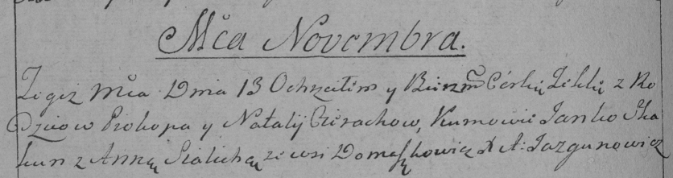

**Церах Прокоп (Cierach Prokop)**

13 ноября 1792 г -- крещение дочери Текли НИАБ 136-13-894, лист 17об,
№72/1792-р (ориг)), (РГИА 823-2-18, лист 245, №33/1792-р (коп)).

**НИАБ 136-13-894:** Лист 17-об. **Метрическая запись №72/1792-р
(ориг).**

{width="6.496527777777778in"
height="0.6845866141732283in"}

Дедиловичская Покровская церковь. 13 ноября 1792 года. Метрическая
запись о крещении.

Cierachowna Tekla -- дочь селян с деревни Домашковичи.

Cierach Prokop -- отец.

Cierachowa Natalla -- мать.

Skakun Janka - кум.

Sialicka Anna - кума.

Jazgunowicz Antoni -- ксёндз.

**РГИА 823-2-18:** Лист 245об. **Метрическая запись №33/1792-р (коп).**

{width="6.496527777777778in"
height="1.7173611111111111in"}

Дедиловичская Покровская церковь. 13 ноября 1792 года. Метрическая
запись о крещении.

Cierachowna Tekla -- дочь родителей с деревни Домашковичи.

Cierach Prokop -- отец.

Cierachowa Natalija -- мать.

Skakun Janko -- кум.

Sialicka Anna -- кума.

Jazgunowicz Antoni -- ксёндз.
