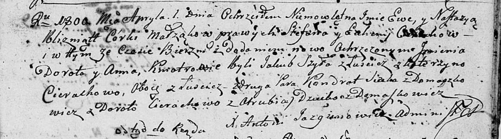
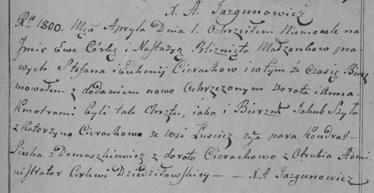
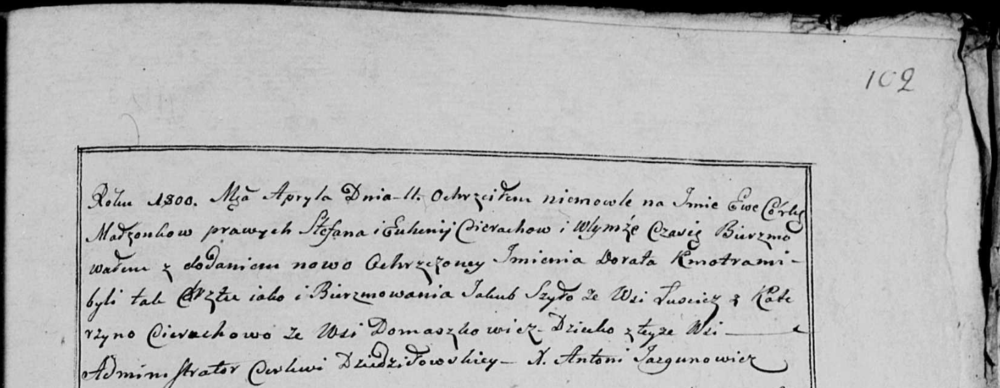

**Церах Ева Степанова (Cierachowna Ewa Dorota)**

1 апреля 1800 г -- крещение (НИАБ 136-13-894, лист 41, №12/1800-р
(ориг), РГИА 823-2-18, лист 275, №12/1800-р (коп), НИАБ 136-13-949, лист
102, №12/1800-р (коп)).

**НИАБ 136-13-894:** Лист 41. **Метрическая запись №12/1800-р (ориг).**

Дедиловичская Покровская церковь. 1 апреля 1800 года. Метрическая запись
о крещении.

Cierachowna Ewa Dorota -- близнец, дочь родителей с деревни Домашковичи.

Cierachowna Nastazyja Anna -- близнец, дочь родителей с деревни
Домашковичи.

Cierach Stefan -- отец.

Cierachowa Euhenija -- мать.

Szyło Jakub -- кум, крестный отец Евы Дороты, с деревни Лустичи.

Cierachowa Katerzyna -- кума, крестная мать Евы Дороты, с деревни
Лустичи.

Siczko? Kondrat -- кум, крестный отец Настасьи Анны, с деревни
Домашковичи.

Cierachowa Dorota -- кума, крестная мать Настасьи Анны, с деревни Отруб.

Jazgunowicz Antoni -- ксёндз.

**РГИА 823-2-18:** Лист 275. **Метрическая запись №12/1800-р (коп).**

Дедиловичская Покровская церковь. 1 апреля 1800 года. Метрическая запись
о крещении.

Cierachowna Ewa Dorota -- близнец, дочь родителей с деревни
\[Домашковичи\].

Cierachowna Nastazya Anna -- близнец, дочь родителей с деревни
\[Домашковичи\].

Cierach Stefan -- отец.

Cierachowa Euhenija -- мать.

Szyła Jakub -- кум, с деревни Лустичи.

Cierachowa Katerzyna -- кума, с деревни Лустичи.

Siczko Kondrat -- кум, с деревни Домашковичи.

Cierachowa Dorota -- кума, с деревни Отруб.

Jazgunowicz Antoni -- ксёндз.

**НИАБ 136-13-949:** Лист 102. **Метрическая запись №12/1800-р (коп).**

(См. тж.: РГИА 823-2-18, лист 275, №12/1800-р (коп), НИАБ 136-13-894,
лист 41, №12/1800-р (ориг))

Дедиловичская Покровская церковь. 11 апреля 1800 года. Метрическая
запись о крещении.

Cierachowna Ewa Dorota -- дочь родителей с деревни Домашковичи.

Cierach Stefan -- отец.

Cierachowa Euhenia -- мать.

Szyło Jakub -- кум, с деревни Лустичи.

Cierachowa Katerzyna - кума, с деревни Домашковичи \[Лустичи\].

Jazgunowicz Antoni -- ксёндз.
