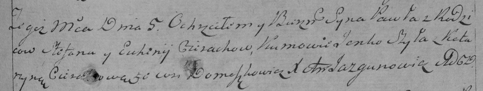

**Церах (Лапец) Евгения (Cierachowa Euhenija z Łapciow)**

27 октября 1790 г -- венчание со Степаном Церахом (НИАБ 136-13-894, лист
68об, №9/1790-б (ориг)).

5 ноября 1794 г -- крещение сына Павла НИАБ 136-13-894, лист 23,
№52/1794-р (ориг)), (РГИА 823-2-18, лист 251, №38/1794-р (коп)).

28 июля 1797 г -- крещение дочери Хрыстыны (НИАБ 136-13-894, лист 34,
№48/1797-р (ориг)).

1 апреля 1800 г -- крещение дочерей близнецов Евы Дороты и Настасьи Анны
(НИАБ 136-13-894, лист 41, №12/1800-р (ориг), РГИА 823-2-18, лист 275,
№12/1800-р (коп), НИАБ 136-13-949, лист 102, №12/1800-р (коп)).

**НИАБ 136-13-894:** Лист 68об. **Метрическая запись №9/1790-б (ориг).**

{width="6.496527777777778in"
height="1.0097812773403325in"}

Дедиловичская Покровская церковь. 27 октября 1790 года. Метрическая
запись о венчании.

Cierach Stefan -- жених, с деревни Домашковичи.

Łapciowa Euhenia -- невеста.

Cierach Leon -- свидетель.

Łapać Hryhor -- свидетель.

Jazgunowicz Antoni -- ксёндз.

**НИАБ 136-13-894:** Лист 23. **Метрическая запись №52/1794-р (ориг).**

{width="6.496527777777778in"
height="1.1036515748031497in"}

Дедиловичская Покровская церковь. 5 ноября 1794 года. Метрическая запись
о крещении.

Cierach Paweł -- сын родителей с деревни Домашковичи.

Cierach Stefan -- отец.

Cierachowa Euhenija -- мать.

Szyło Jakub - кум.

Cierachowa Katerzyna - кума.

Jazgunowicz Antoni -- ксёндз.

**РГИА 823-2-18:** Лист 251. **Метрическая запись №38/1794-р (коп).**

{width="6.496527777777778in"
height="1.225in"}

Дедиловичская Покровская церковь. 5 ноября 1794 года. Метрическая запись
о крещении.

Cierach Paweł -- сын родителей с деревни Домашковичи.

Cierach Stefan -- отец.

Cierachowa Euhenija -- мать.

Szyła Janko -- кум.

Cierachowa Katarzyna -- кума.

Jazgunowicz Antoni -- ксёндз.

**НИАБ 136-13-894:** Лист 34. **Метрическая запись №48/1797-р (ориг).**

{width="6.496527777777778in"
height="1.0084405074365703in"}

Дедиловичская Покровская церковь. 28 июля 1797 года. Метрическая запись
о крещении.

Cierachowna Krystyna -- дочь родителей с деревни Домашковичи.

Cierach Stefan -- отец.

Cierachowa Euhenija -- мать.

Szyło Jakub - кум.

Cierachowa Katerzyna - кума.

Jazgunowicz Antoni -- ксёндз.

**НИАБ 136-13-894:** Лист 41. **Метрическая запись №12/1800-р (ориг).**

{width="6.496527777777778in"
height="1.8070122484689415in"}

Дедиловичская Покровская церковь. 1 апреля 1800 года. Метрическая запись
о крещении.

Cierachowna Ewa Dorota -- близнец, дочь родителей с деревни Домашковичи.

Cierachowna Nastazyja Anna -- близнец, дочь родителей с деревни
Домашковичи.

Cierach Stefan -- отец.

Cierachowa Euhenija -- мать.

Szyło Jakub -- кум, крестный отец Евы Дороты, с деревни Лустичи.

Cierachowa Katerzyna -- кума, крестная мать Евы Дороты, с деревни
Лустичи.

Siczko? Kondrat -- кум, крестный отец Настасьи Анны, с деревни
Домашковичи.

Cierachowa Dorota -- кума, крестная мать Настасьи Анны, с деревни Отруб.

Jazgunowicz Antoni -- ксёндз.

**РГИА 823-2-18:** Лист 275. **Метрическая запись №12/1800-р (коп).**

{width="6.496527777777778in"
height="3.363888888888889in"}

Дедиловичская Покровская церковь. 1 апреля 1800 года. Метрическая запись
о крещении.

Cierachowna Ewa Dorota -- близнец, дочь родителей с деревни
\[Домашковичи\].

Cierachowna Nastazya Anna -- близнец, дочь родителей с деревни
\[Домашковичи\].

Cierach Stefan -- отец.

Cierachowa Euhenija -- мать.

Szyła Jakub -- кум, с деревни Лустичи.

Cierachowa Katerzyna -- кума, с деревни Лустичи.

Siczko Kondrat -- кум, с деревни Домашковичи.

Cierachowa Dorota -- кума, с деревни Отруб.

Jazgunowicz Antoni -- ксёндз.

**НИАБ 136-13-949:** Лист 102. **Метрическая запись №12/1800-р (коп).**

(См. тж.: РГИА 823-2-18, лист 275, №12/1800-р (коп), НИАБ 136-13-894,
лист 41, №12/1800-р (ориг))

{width="6.496527777777778in"
height="2.525in"}

Дедиловичская Покровская церковь. 11 апреля 1800 года. Метрическая
запись о крещении.

Cierachowna Ewa Dorota -- дочь родителей с деревни Домашковичи.

Cierach Stefan -- отец.

Cierachowa Euhenia -- мать.

Szyło Jakub -- кум, с деревни Лустичи.

Cierachowa Katerzyna - кума, с деревни Домашковичи \[Лустичи\].

Jazgunowicz Antoni -- ксёндз.
