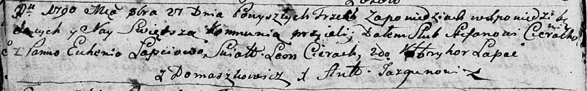

**Церах Павел Степанов (Cierach Paweł)**

5 ноября 1794 г -- крещение (НИАБ 136-13-894, лист 23, №52/1794-р
(ориг)), (РГИА 823-2-18, лист 251, №38/1794-р (коп)).

**НИАБ 136-13-894:** Лист 23. **Метрическая запись №52/1794-р (ориг).**

{width="6.496527777777778in"
height="1.1036515748031497in"}

Дедиловичская Покровская церковь. 5 ноября 1794 года. Метрическая запись
о крещении.

Cierach Paweł -- сын родителей с деревни Домашковичи.

Cierach Stefan -- отец.

Cierachowa Euhenija -- мать.

Szyło Jakub - кум.

Cierachowa Katerzyna - кума.

Jazgunowicz Antoni -- ксёндз.

**РГИА 823-2-18:** Лист 251. **Метрическая запись №38/1794-р (коп).**

{width="6.496527777777778in"
height="1.225in"}

Дедиловичская Покровская церковь. 5 ноября 1794 года. Метрическая запись
о крещении.

Cierach Paweł -- сын родителей с деревни Домашковичи.

Cierach Stefan -- отец.

Cierachowa Euhenija -- мать.

Szyła Janko -- кум.

Cierachowa Katarzyna -- кума.

Jazgunowicz Antoni -- ксёндз.
