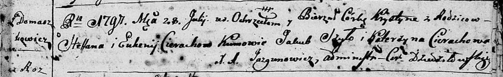

**Церах Хрыстына Степанова (Cierachowna Krystyna)**

28 июля 1797 г -- крещение дочери Хрыстыны (НИАБ 136-13-894, лист 34,
№48/1797-р (ориг)).

**НИАБ 136-13-894:** Лист 34. **Метрическая запись №48/1797-р (ориг).**

Дедиловичская Покровская церковь. 28 июля 1797 года. Метрическая запись
о крещении.

Cierachowna Krystyna -- дочь родителей с деревни Домашковичи.

Cierach Stefan -- отец.

Cierachowa Euhenija -- мать.

Szyło Jakub - кум.

Cierachowa Katerzyna - кума.

Jazgunowicz Antoni -- ксёндз.
