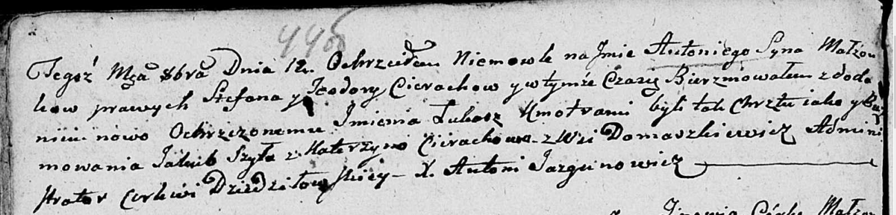

**Церах Антон Степанов (Cierach Antoni Łukasz)**

12 октября 1801 г -- крещение НИАБ 136-13-894, лист 44об, №24/1801-р
(ориг)).

**НИАБ 136-13-894:** Лист 44об. **Метрическая запись №24/1801-р
(ориг).**

{width="6.496527777777778in"
height="1.5642891513560806in"}

Дедиловичская Покровская церковь. 12 октября 1801 года. Метрическая
запись о крещении.

Cierach Antoni Łukasz -- сын родителей с деревни Домашковичи.

Cierach Stefan -- отец.

Cierachowa Teodora -- мать.

Szyło Jakub -- кум.

Cierachowa Katerzyna -- кума.

Jazgunowicz Antoni -- ксёндз.
