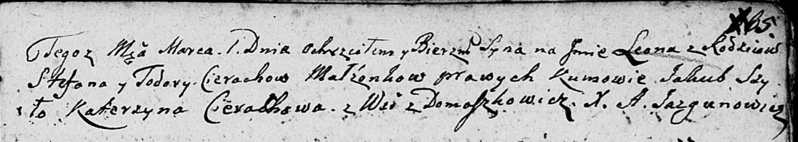

**Церах Леон Степанов (Cierach Leon)**

1 марта 1808 г -- крещение (НИАБ 136-13-894, лист 65, №13/1808-р
(ориг)).

**НИАБ 136-13-894:** Лист 65. **Метрическая запись №13/1808-р (ориг).**

{width="6.496527777777778in"
height="1.1639971566054244in"}

Дедиловичская Покровская церковь. 1 марта 1808 года. Метрическая запись
о крещении.

Cierach Leon -- сын родителей с деревни Домашковичи.

Cierach Stefan -- отец.

Cierachowa Todora -- мать.

Szyło Jakub -- кум.

Cierachowa Katerzyna -- кума.

Jazgunowicz Antoni -- ксёндз.
