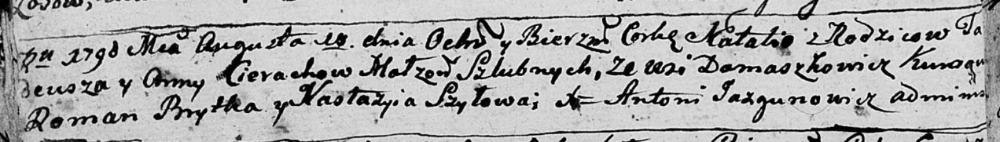

**Церах Анна (Cierachowa Anna)**

17 февраля 1788 г -- крещение сына Тодора НИАБ 136-13-894, лист 4,
№22/1788-р (ориг)), (РГИА 823-2-18, лист 235об, №7/1788-р (коп)).

17 августа 1790 г -- крещение дочери Натальи НИАБ 136-13-894, лист 10об,
№58/1790-р (ориг)).

3 октября 1792 г -- крещение сына Хомы НИАБ 136-13-894, лист 17,
№61/1792-р (ориг)).

9 февраля 1796 г -- крещение дочери Ульяны НИАБ 136-13-894, лист 28,
№17/1796-р (ориг)).

**НИАБ 136-13-894:** Лист 4. **Метрическая запись №22/1788-р (ориг).**

{width="6.496527777777778in"
height="0.6436854768153981in"}

Дедиловичская Покровская церковь. 17 февраля 1788 года. Метрическая
запись о крещении.

Cierach Teodor -- сын родителей с деревни Домашковичи.

Cierach Tadeusz -- отец.

Cierachowa ? -- мать.

Brytka Roman - кум.

Cierachowna Nastazyia - кума.

Jazgunowicz Antoniusz -- ксёндз.

**РГИА 823-2-18:** Лист 235об. **Метрическая запись №7/1788-р (коп).**

{width="6.496527777777778in"
height="1.1520833333333333in"}

Дедиловичская Покровская церковь. 17 февраля 1788 года. Метрическая
запись о крещении.

Cierach Teodor -- сын родителей с деревни Домашковичи.

Cierach Tadeusz -- отец.

Cierachowa Anna -- мать.

Brytka Roman -- кум.

Cierachowna Nastazya - кума.

Jazgunowicz Antoni -- ксёндз.

**НИАБ 136-13-894:** Лист 10об. **Метрическая запись №58/1790-р
(ориг).**

{width="6.496527777777778in"
height="0.9246270778652669in"}

Дедиловичская Покровская церковь. 17 августа 1790 года. Метрическая
запись о крещении.

Cierachowna Natalia -- дочь родителей с деревни Домашковичи.

Cierach Tadeusz -- отец.

Cierachowa Anna -- мать.

Brytka Roman - кум.

Szyłowa Nastazyia - кума.

Jazgunowicz Antoni -- ксёндз.

**НИАБ 136-13-894:** Лист 17. **Метрическая запись №61/1792-р (ориг).**

{width="6.496527777777778in"
height="0.8247222222222222in"}

Дедиловичская Покровская церковь. 3 октября 1792 года. Метрическая
запись о крещении.

Cierach Thomasz -- сын родителей с деревни Домашковичи.

Cierach Thadeusz -- отец.

Cierachowa Anna -- мать.

Brytka Roman - кум.

Szydłowska Nasta - кума.

Jazgunowicz Antoni -- ксёндз.

Лист 28. **Метрическая запись №17/1796-р (ориг).**

{width="6.496527777777778in"
height="0.890430883639545in"}

Дедиловичская Покровская церковь. 9 февраля 1796 года. Метрическая
запись о крещении.

Cierachowna Ullana -- дочь родителей с деревни Домашковичи.

Cierach Thadeusz -- отец.

Cierachowa Anna -- мать.

Szyło Leon - кум.

Cierachowa Euhenija - кума.

Jazgunowicz Antoni -- ксёндз.
