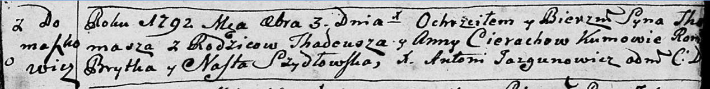

**Церах Хома Тадеев (Cierach Thomasz)**

3 октября 1792 г -- крещение НИАБ 136-13-894, лист 17, №61/1792-р
(ориг)).

**НИАБ 136-13-894:** Лист 17. **Метрическая запись №61/1792-р (ориг).**

{width="6.496527777777778in"
height="0.8247222222222222in"}

Дедиловичская Покровская церковь. 3 октября 1792 года. Метрическая
запись о крещении.

Cierach Thomasz -- сын родителей с деревни Домашковичи.

Cierach Thadeusz -- отец.

Cierachowa Anna -- мать.

Brytka Roman - кум.

Szydłowska Nasta - кума.

Jazgunowicz Antoni -- ксёндз.
