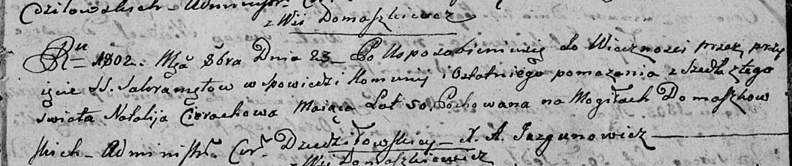

**Церах Наталья (Cierachowa Natalija)**

23 октября 1802 г -- отпевание, умерла в возрасте 50 лет (родилась около
1752 г) (НИАБ 136-13-919, лист 13, №13/1802-у (ориг)).

**НИАБ 136-13-919:** Лист 13. **Метрическая запись №13/1802-у (ориг).**

{width="6.496527777777778in"
height="1.3694444444444445in"}

Дедиловичская Покровская церковь. 23 октября 1802 года. Метрическая
запись об отпевании.

Cierachowa Natalija -- умершая, 50 лет, с деревни Домашковичи,
похоронена на кладбище деревни Домашковичи.

Jazgunowicz Antoni -- ксёндз.
