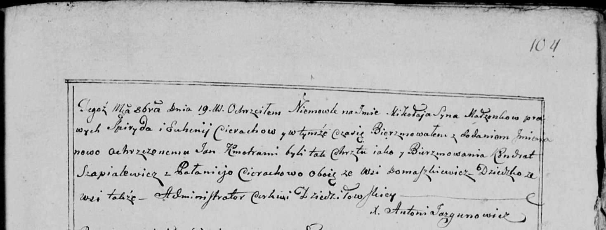

**Церах Паланея (Cierachowa Pałanieja)**

19 октября 1800 г -- крестная мать Миколая Яна, сына Церахов Спирыда и
Евгении с деревни Домашковичи (НИАБ 136-13-894, лист 42об, №31/1800-р
(ориг), НИАБ 136-13-949, лист 104, №34/1800-р (коп)).

**НИАБ 136-13-949:** Лист 104. **Метрическая запись №34/1800-р (коп).**

(См. тж.: НИАБ 136-13-894, лист 42, №31/1800-р (ориг))

Дедиловичская Покровская церковь. 19 октября 1800 года. Метрическая
запись о крещении.

Cierach Mikołay Jan -- сын родителей с деревни Домашковичи.

Cierach Spiryd -- отец.

Cierachowa Euhenia -- мать.

Szapialewicz Kondrat -- кум, с деревни Домашковичи.

Cierachowa Pałanieja - кума, с деревни Домашковичи.

Jazgunowicz Antoni -- ксёндз.
