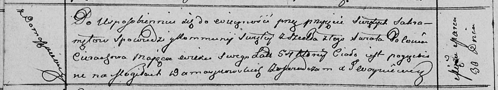

**Церах Полония (Cierachowa Połonia)**

30 марта 1812 г -- отпевание, умерла в возрасте 54 лет (родилась около
1758 г) (НИАБ 136-13-919, лист 23об, №5/1812-у (ориг)).

**НИАБ 136-13-919:** Лист 23об. **Метрическая запись №5/1812-у (ориг).**

{width="6.496527777777778in"
height="1.1875in"}

Осовская униатская церковь. 30 марта 1812 года. Метрическая запись об
отпевании.

Cierachowa Połonia -- умершая, 54 года, с деревни Домашковичи,
похоронена на кладбище деревни Домашковичи.

Woyniewicz Tomasz -- ксёндз.
