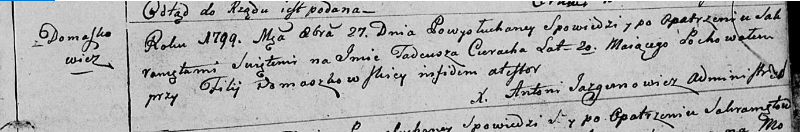
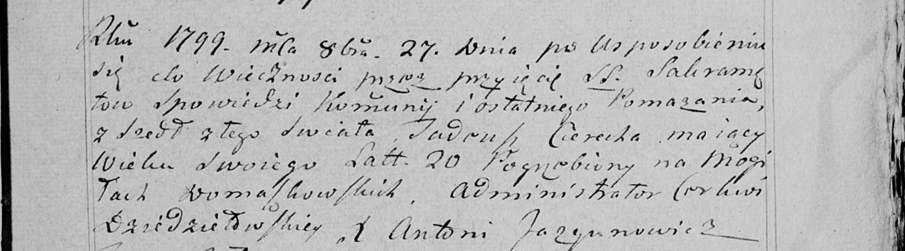

**Церах Тадей (Cierach Tadeusz)**

27 октября 1799 г -- отпевание, умер в возрасте 20 лет (родился около
1779 г) (НИАБ 136-13-919, лист 9, №15/1799-у (ориг), НИАБ 136-13-938,
лист 252, №15/1799-у (коп)).

**НИАБ 136-13-919:** Лист 9. **Метрическая запись №15/1799-у (ориг).**

Дедиловичская Покровская церковь. 27 октября 1799 года. Метрическая
запись об отпевании.

Cierach Tadeusz -- умерший, 20 лет, с деревни Домашковичи, похоронен на
кладбище при филии Домашковичской.

Jazgunowicz Antoni -- ксёндз.

**НИАБ 136-13-938:** Лист 252. **Метрическая запись №15/1799-у (коп).**

(См. тж. НИАБ 136-13-919, Лист 9. Метрическая запись №15/1799-у (ориг))

Дедиловичская Покровская церковь. 27 октября 1799 года. Метрическая
запись об отпевании.

Cierach Tadeusz -- умерший, 20 лет, с деревни \[Домашковичи\], похоронен
на кладбище деревни Домашковичи.

Jazgunowicz Antoni -- ксёндз.
