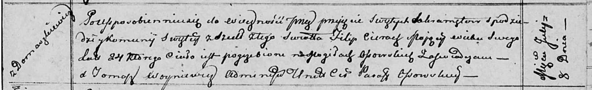

**Церах Филип (Cierach Filip)**

8 июля 1812 г -- отпевание, умер в возрасте 24 лет (родился около 1788
г) (НИАБ 136-13-919, лист 24, №11/1812-у (ориг)).

**НИАБ 136-13-919:** Лист 24. **Метрическая запись №11/1812-у (ориг).**

Осовская униатская церковь. 8 июля 1812 года. Метрическая запись об
отпевании.

Cierach Filip -- умерший, 24 года, с деревни Домашковичи, похоронен на
кладбище деревни Осово.

Woyniewicz Tomasz -- ксёндз.
