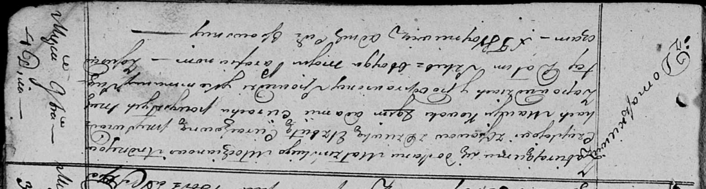
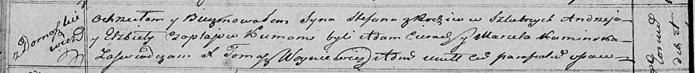

**Чапляй Андрей (Czaplay Andrzey)**

4 ноября 1818 г -- венчание с девкой Елисаветой Церах с деревни
Домашковичи (НИАБ 136-13-920, лист 25, №6/1818-б (ориг)).

4 января 1820 г -- крещение сына Стефана (НИАБ 136-13-894, лист 103об,
№2/1820-р (ориг)).

**НИАБ 136-13-920:** Лист 25. **Метрическая запись №6/1818-б (ориг).**

Осовская Покровская церковь. 4 ноября 1818 года. Запись о венчании.

Czapłay Andrzey -- жених, молодой, парафии Осовской, с деревни Осово.

Cierachowna Elżbieta -- невеста, девка, парафии Осовской, с деревни
Домашковичи.

Kowal Maciey -- свидетель.

Cierach Adam -- свидетель.

Woyniewicz Tomasz -- ксёндз.

**НИАБ 136-13-894:** Лист 103об. **Метрическая запись №2/1820-р
(ориг).**

Осовская Покровская церковь. 4 января 1820 года. Метрическая запись о
крещении.

Czaplay Stefan -- сын родителей с деревни Домашковичи.

Czaplay Andrzey -- отец.

Czaplaiowa Elżbieta -- мать.

Cierach Adam -- кум.

Kaminska Marcela -- кума.

Woyniewicz Tomasz -- ксёндз.
