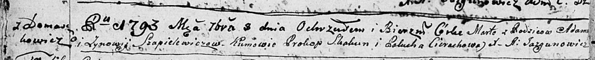

**Шапелевич Зыновья (Szapielewiczowa Zynowija)**

8 сентября 1793 г -- крещение дочери Марты НИАБ 136-13-894, лист 20об,
№75/1793-р (ориг)).

**НИАБ 136-13-894:** Лист 20-об. **Метрическая запись №75/1793-р
(ориг).**

Дедиловичская Покровская церковь. 8 сентября 1793 года. Метрическая
запись о крещении.

Szapielewiczowna Marta -- дочь родителей с деревни Домашковичи.

Szapielewicz Adam -- отец.

Szapielewiczowa Zynowija-- мать.

Skakun Prokop - кум.

Cierachowa Paliucha - кума.

Jazgunowicz Antoni -- ксёндз.
