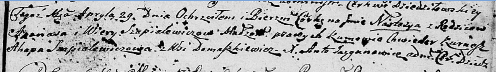

**Шапелевич Вяра (Szapielewiczowa Wiara)**

29 апреля 1806 г -- крещение дочери Настасьи (НИАБ 136-13-894, лист 60,
№24/1806-р (ориг)).

**НИАБ 136-13-894:** Лист 60. **Метрическая запись №24/1806-р (ориг).**

{width="6.496527777777778in"
height="0.9594936570428696in"}

Дедиловичская Покровская церковь. 29 апреля 1806 года. Метрическая
запись о крещении.

Szapialewiczowna Nastazya -- дочь родителей с деревни Домашковичи.

Szapialewicz Apanas -- отец.

Szapialewiczowa Wiera -- мать.

Kurnesz Chwiedor -- кум.

Szapialewiczowa Ahapa -- кума.

Jazgunowicz Antoni -- ксёндз.
