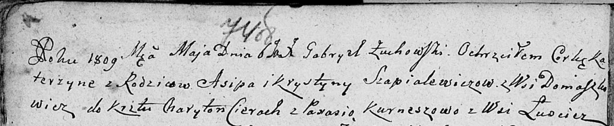

**Шапелевич Крыстына (Szapielewiczowa Krystyna)**

6 мая 1809 г -- крещение дочери Катерыны (НИАБ 136-13-894, лист 74об,
№22/1809-р (ориг)).

**НИАБ 136-13-894:** Лист 74об. **Метрическая запись №22/1809-р
(ориг).**

Дедиловичская Покровская церковь. 6 мая 1809 года. Метрическая запись о
крещении.

Szapialewiczowna Katerzyna -- дочь родителей с деревни Домашковичи.

Szapialewicz Asip -- отец.

Szapialewiczowa Krystyna -- мать.

Cierach Charyton -- кум.

Kurneszowa Parasia -- кума, с деревни Лустичи.

Żuchowski Gabryel -- ксёндз.
