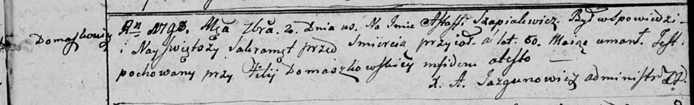

**Шапелевич Астап (Szapielewicz Astap, Astapka, Astaffi)**

23 марта 1785 г -- крещение сына Якуба (РГИА 823-2-18, лист 228об,
№9/1785-р (ориг)).

11 июля 1787 г -- крещение сына Антона (НИАБ 136-13-894, лист 2,
№27/1787-р (ориг)), (РГИА 823-2-18, лист 234, №18/1787-р (коп)).

2 сентября 1798 г -- отпевание, умер в возрасте 60 лет (родился около
1738 г) (НИАБ 136-13-919, лист 8, №13/1798-у (ориг)).

**РГИА 823-2-18:** Лист 228об. **Метрическая запись №9/1785-р (коп).**

Дедиловичская Покровская церковь. 23 марта 1785 года. Метрическая запись
о крещении.

Szapielewicz Jakub -- сын родителей с деревни Домашковичи.

Szapielewicz Astapka -- отец.

Szapielewiczowa Natalla -- мать.

Kurnesz Mikita -- кум.

Cierachowa Paraska - кума.

Jazgunowicz Antoni -- ксёндз.

**НИАБ 136-13-894:** Лист 2. **Метрическая запись №27/1787-р (ориг).**

Дедиловичская Покровская церковь. 11 июля 1787 года. Метрическая запись
о крещении.

Szapielewicz Antonij - сын родителей с деревни Домашковичи.

Szapielewicz Astap -- отец.

Szapielewiczowa Natalia -- мать.

Kurnesz Mikita -- кум.

Cierachowa Paraskiewija - кума.

Jazgunowicz Antoniusz -- ксёндз.

**РГИА 823-2-18:** Лист 234. **Метрическая запись №18/1787-р (коп).**

Дедиловичская Покровская церковь. 11 июля 1787 года. Метрическая запись
о крещении.

Szapielewicz Antoni -- сын родителей с деревни Домашковичи.

Szapielewicz Astap -- отец.

Szapielewiczowa Natalla -- мать.

Kurnesz Mikita -- кум.

Cierachowa Paraska - кума.

Jazgunowicz Antoni -- ксёндз.

**НИАБ 136-13-919:** Лист 8. **Метрическая запись №13/1798-у (ориг).**

Дедиловичская Покровская церковь. 2 сентября 1798 года. Метрическая
запись об отпевании.

Szapialewicz Astaffi -- умерший, 60 лет, с деревни Домашковичи,
похоронен на кладбище при филии Домашковичской.

Jazgunowicz Antoni -- ксёндз.
