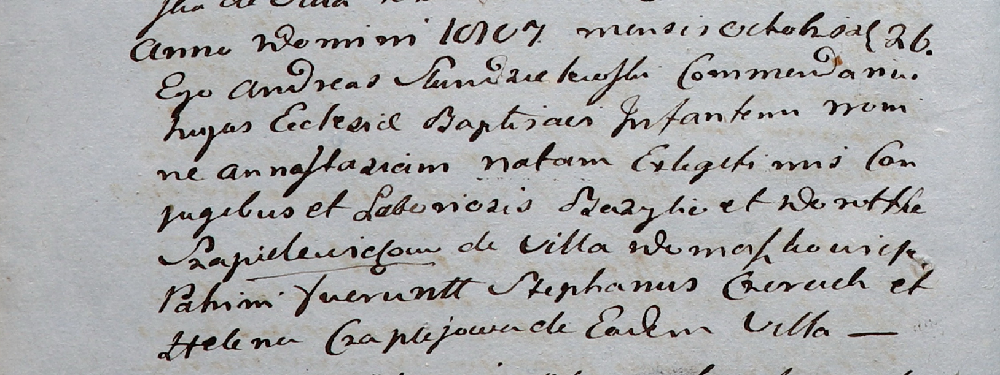

**Шапелевич Дорота (Szapielewiczowa Dorotha)**

26 октября 1807 г -- крещение дочери Анастасии (НИАБ 937-4-32, лист
16об, №22/1807-р).

**НИАБ 937-4-32:** Лист 16об. **Метрическая запись №22/1807-р.**

Дедиловичский костел Наисвятейшего Сердца Иисуса. 26 октября 1807 года.
Метрическая запись о крещении.

Szapielewiczowna Annastazia -- дочь крестьян с деревни Домашковичи.

Szapielewicz Bazyli -- отец.

Szapielewiczowa Dorotha -- мать.

Czierach Stephan -- крестный отец.

Czaplaiowa Helena -- крестная мать, с деревни Домашковичи.

Scindzelewski Andreas -- ксёндз, викарий Дедиловичский.
