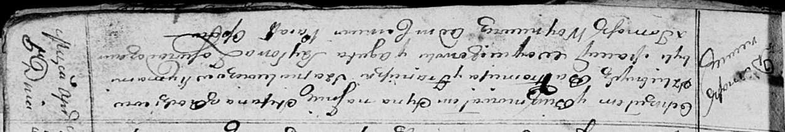

**Шапелевич Балтромей (Szapielewicz Bałtromiey)**

5 апреля 1814 г -- крещение сына Стефана (НИАБ 136-13-894, лист 89,
№25/1814-р (ориг)).

**НИАБ 136-13-894:** Лист 89. **Метрическая запись №25/1814-р (ориг).**

Осовская Покровская церковь. 5 апреля 1814 года. Метрическая запись о
крещении.

Szapialewicz Stefan -- сын родителей с деревни Домашковичи.

Szapialewicz Bałtromey -- отец.

Szapialewiczowa Franciszka -- мать.

Woyciechowski Maciey -- кум.

Szyłowa Agata -- кума.

Woyniewicz Tomasz -- ксёндз.
