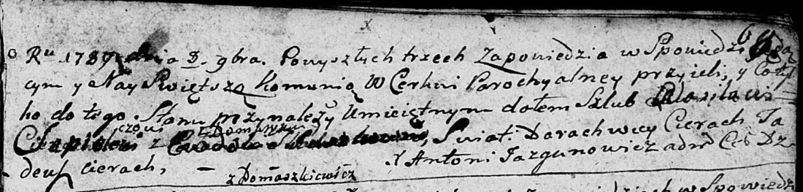

**Шапелевич Василь (Szapielewicz Wasil)**

8 ноября 1789 г -- венчание с Евдокией Сушко? (НИАБ 136-13-894, лист 68,
№8/1789-б (ориг)).

**НИАБ 136-13-894:** Лист 68. **Метрическая запись №8/1789-б (ориг).**

{width="6.496527777777778in"
height="1.5602668416447945in"}

Дедиловичская Покровская церковь. 8 ноября 1789 года. Метрическая запись
о венчании.

Szapielewicz Wasil -- жених, с деревни Домашковичи.

Suszkowna? Ewdokija -- невеста.

Cierach Darachwiey -- свидетель.

Cierach Tadeusz -- свидетель.

Jazgunowicz Antoni -- ксёндз.
