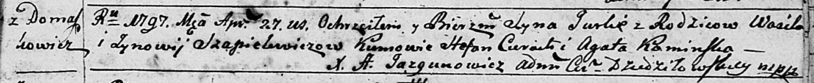
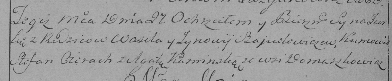

**Шапелевич Юрка Василев (Szapielewicz Jurka)**

27 апреля 1797 г -- крещение (НИАБ 136-13-894, лист 33, №26/1797-р
(ориг)), (РГИА 823-2-18, лист 259об, №19/1797-р (коп)).

**НИАБ 136-13-894:** Лист 33. **Метрическая запись №26/1797-р (ориг).**

Дедиловичская Покровская церковь. 27 апреля 1797 года. Метрическая
запись о крещении.

Szapielewicz Jurka -- сын родителей с деревни Домашковичи.

Szapielewicz Wasil -- отец.

Szapielewiczowa Zynowija -- мать.

Cierach Stefan - кум.

Kaminska Agata - кума.

Jazgunowicz Antoni -- ксёндз.

**РГИА 823-2-18:** Лист 259об. **Метрическая запись №19/1797-р (коп).**

Дедиловичская Покровская церковь. 27 апреля 1797 года. Метрическая
запись о крещении.

Szapielewicz Jurka -- сын родителей с деревни Домашковичи.

Szapielewicz Wasil -- отец.

Szapielewiczowa Zynowia -- мать.

Cierach Stefan -- кум.

Kaminska Agata -- кума.

Jazgunowicz Antoni -- ксёндз.
