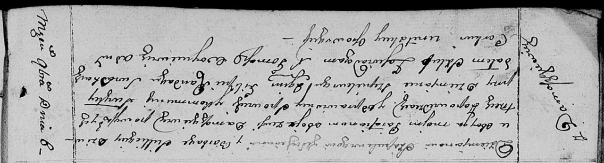

**Шапелевич Демьян (Szapiаlewicz Dziemjan)**

8 ноября 1810 г -- венчание с девкой Варварой Селицкой с деревни
Домашковичи (НИАБ 136-13-920, лист 16об, №6/1810-б (ориг)).

**НИАБ 136-13-920:** Лист 16об. **Метрическая запись №6/1810-б (ориг).**

{width="6.496527777777778in"
height="1.761418416447944in"}

Осовская Покровская церковь. 8 ноября 1810 года. Метрическая запись о
венчании.

Szapialewicz Dziemjan -- жених, молодой, парафии Осовской, с деревни
Домашковичи.

Siellicka Barbara -- невеста, девка, парафии Осовской, с деревни
Домашковичи.

Sziepielewicz Dziemjan -- свидетель.

Randak Filip -- свидетель.

Woyniewicz Tomasz -- ксёндз.
