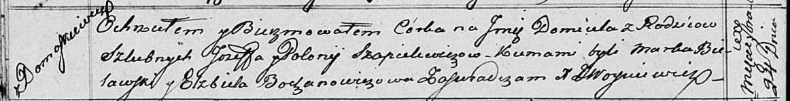

**Шапелевич Полония (Szapielewiczowa Połonia)**

24 сентября 1816 г -- крещение дочери Домицели (НИАБ 136-13-894, лист
94об, №33/1816-р (ориг)).

**НИАБ 136-13-894:** Лист 94об. **Метрическая запись №33/1816-р
(ориг).**

{width="6.496527777777778in"
height="0.8327679352580928in"}

Осовская Покровская церковь. 24 сентября 1816 года. Метрическая запись о
крещении.

Szapielewiczowna Domicela -- дочь родителей с деревни Домашковичи.

Szapielewicz Jozef -- отец.

Szapielewiczowa Połonia -- мать.

Bielawski Marka -- кум.

Bochanowiczowa Elżbieta -- кума.

Woyniewicz Tomasz -- ксёндз.
