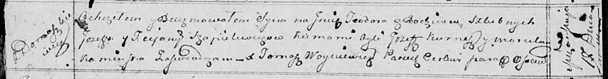

**Шапелевич Иосиф (Szapialewicz Jozef)**

17 мая 1814 г -- крещение сына Тодора (НИАБ 136-13-894, лист 89об,
№31/1814-р (ориг)).

**НИАБ 136-13-894:** Лист 89об. **Метрическая запись №31/1814-р
(ориг).**

{width="6.496527777777778in"
height="0.8455074365704287in"}

Осовская Покровская церковь. 17 мая 1814 года. Метрическая запись о
крещении.

Szapialewicz Teodor -- сын родителей с деревни Домашковичи.

Szapialewicz Jozef -- отец.

Szapialewiczowa Tacjana -- мать.

Kurnesz Jozef -- кум.

Kaminska Marcela -- кума.

Woyniewicz Tomasz -- ксёндз.
