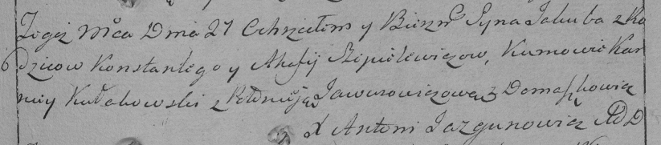

**Шапелевич Константы (Szapielewicz Konstanty)**

27 декабря 1796 г -- крещение сына Якуба (НИАБ 136-13-894, лист 31об,
№99/1796-р (ориг)), (РГИА 823-2-18, лист 258, №62/1796-р (коп)).

**НИАБ 136-13-894:** Лист 31-об. **Метрическая запись №99/1796-р
(ориг).**

{width="6.496527777777778in"
height="0.9252974628171479in"}

Дедиловичская Покровская церковь. 27 декабря 1796 года. Метрическая
запись о крещении.

Szapielewicz Jakub -- сын родителей с деревни Домашковичи.

Szapielewicz Konstanty -- отец.

Szapielewiczowa Ahaffia -- мать.

Kułakowski Karniey - кум.

Jawurowiczowa Palanieja - кума.

Jazgunowicz Antoni -- ксёндз.

**РГИА 823-2-18:** Лист 258. **Метрическая запись №62/1796-р (коп).**

{width="6.496527777777778in"
height="1.4284722222222221in"}

Дедиловичская Покровская церковь. 27 декабря 1796 года. Метрическая
запись о крещении.

Szapielewicz Jakub -- сын родителей с деревни Домашковичи.

Szapielewicz Konstanty -- отец.

Szapielewiczowa Ahafija -- мать.

Kułakowski Karniey -- кум.

Jawurowiczowa Połonieja -- кума.

Jazgunowicz Antoni -- ксёндз.
