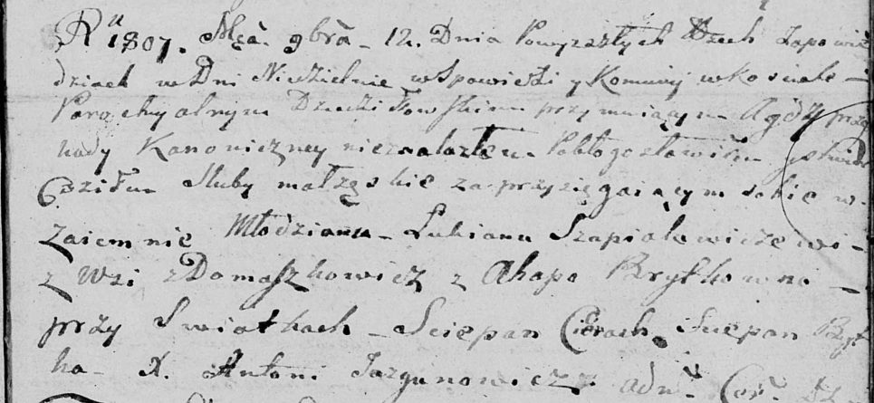

**Шапялевич Агапа (Szapialewiczowa (Brytkowa) Ahapa)**

12 ноября 1807 г -- венчание с молодым Лукьяном Шапялевичем с деревни
Домашковичи (НИАБ 136-13-920, лист 13, №11/1807-б (ориг)).

**НИАБ 136-13-894:** Лист 13. **Метрическая запись №11/1807-б (ориг).**

Дедиловичская Покровская церковь. 12 ноября 1807 года. Метрическая
запись о венчании.

Szapialewicz Łukjan -- жених, молодой, с деревни Домашковичи.

Brytkowna Ahapa -- невеста.

Cierach Scepan -- свидетель.

Brytka Sciepan -- свидетель.

Jazgunowicz Antoni -- ксёндз.
