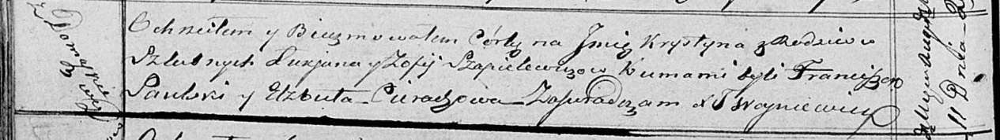

**Шапялевич Крыстына Лукьянова (Szapialewiczowna Krystyna)**

11 августа 1818 г -- крещение (НИАБ 136-13-894, лист 98об, №25/1818-р
(ориг)).

**НИАБ 136-13-894:** Лист 98об. **Метрическая запись №25/1818-р
(ориг).**

Осовская Покровская церковь. 11 августа 1818 года. Метрическая запись о
крещении.

Szapialewiczowna Krystyna -- дочь родителей с деревни Домашковичи.

Szapialewicz Łukjan -- отец.

Szapialewiczowa Zofija -- мать.

Saulski Franciszek -- кум.

Cierachowa Elżbieta -- кума.

Woyniewicz Tomasz -- ксёндз.
